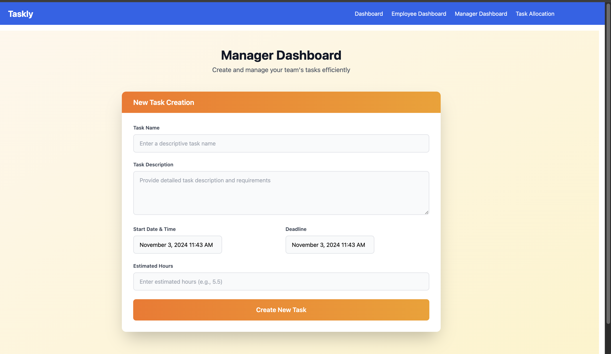

# Taskly

The goal of taskly is to allow managers to create tasks without having to think about assigning them to certain employees.

The manager just needs to create a task.

Then the employees are assigned optimally.

## Employee Dashboard

## Manager Dashboard

