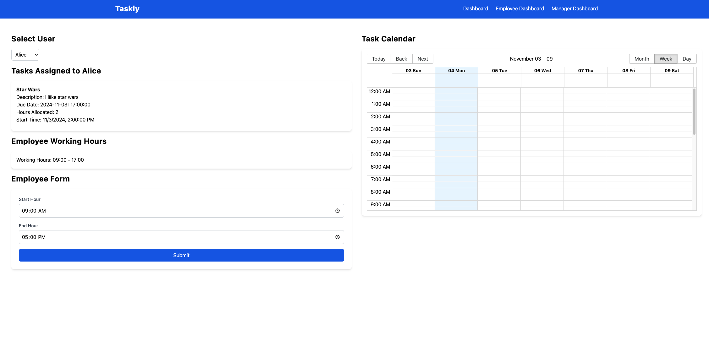
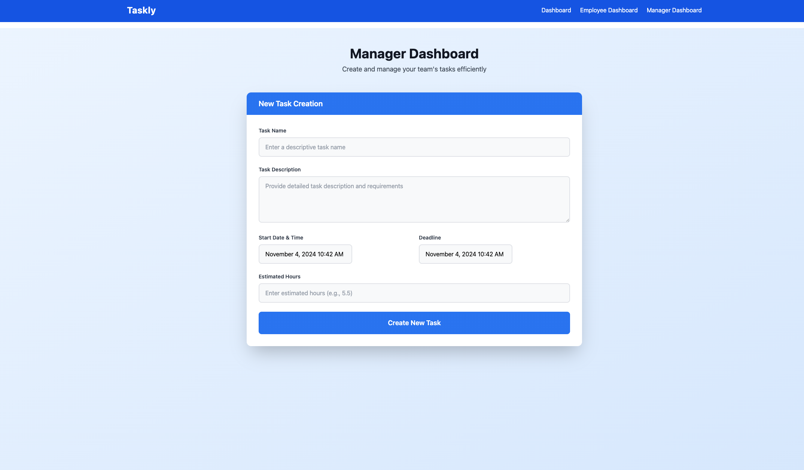

# Taskly

The goal of taskly is to allow managers to create tasks without having to think about assigning them to certain employees.

The manager just needs to create a task.

Then the employees are assigned optimally.

## Home Page


## Dashboard Page


## Employee Dashboard



## Manager Dashboard



## Running it

Frontend:

```bash
npm i && npm run dev
```

Backend:

```bash
pip3 install flask flask_cors
cd backend
python3 server.py
```
